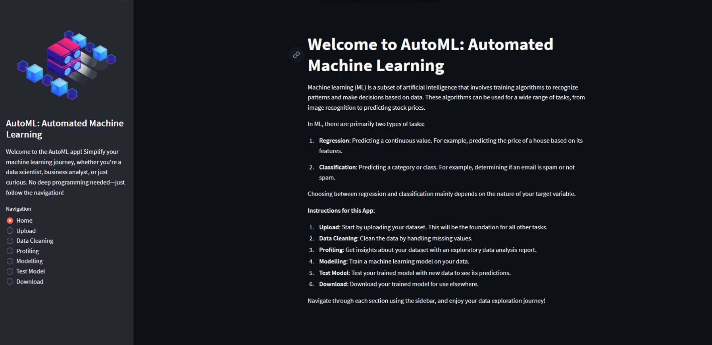

# AutoML: Automated Machine Learning

Welcome to the AutoML application! This app is designed to simplify the journey of machine learning for users ranging from data scientists to business analysts, and for those who are simply curious about ML. No deep programming knowledge is required. Simply follow the navigation to experience the automated process of training and testing ML models.


## Requirements

- **Python**: Version 3.7 - 3.10 (required due to `pycaret`)

### Dependencies
Below are the main libraries and packages utilized in this application:
- os
- pickle
- numpy
- pandas
- pandas_profiling
- plotly.express
- streamlit
- sklearn
- streamlit_pandas_profiling
- pycaret

To install these dependencies, simply run:

```
pip install -r requirements.txt
```

## Features and Functionalities

- **Home**: Introduction to machine learning and app usage instructions.
- **Upload**: Upload a dataset in CSV format to use for machine learning training.
- **Data Cleaning**: Handle missing values and clean the dataset.
- **Profiling**: Generate an exploratory data analysis report for the uploaded dataset.
- **Modelling**: Train a machine learning model, either for classification or regression, based on the dataset.
- **Test Model**: Use the trained model to make predictions on new data input.
- **Download**: Download the trained model for use in other applications or platforms.

## How to Use

1. **Clone or Download**: Clone this repository or download the zip file.
2. **Install Dependencies**: Navigate to the app's directory and run `pip install -r requirements.txt`.
3. **Run the App**: In the same directory, run `streamlit run app_name.py` (replace `app_name.py` with the name of your main application file if it's different).
4. **Navigate**: Use the navigation bar in the app to move between different functionalities.

## Demo

For a detailed walkthrough of the app and its features, check out our tutorial video:

[](./tutorial.mp4)

*Note: Click on the image above to play the tutorial.